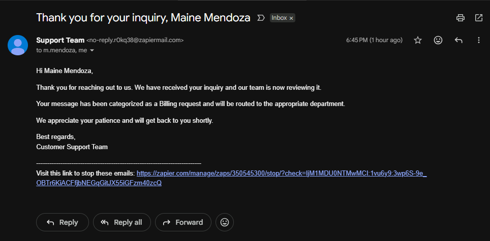
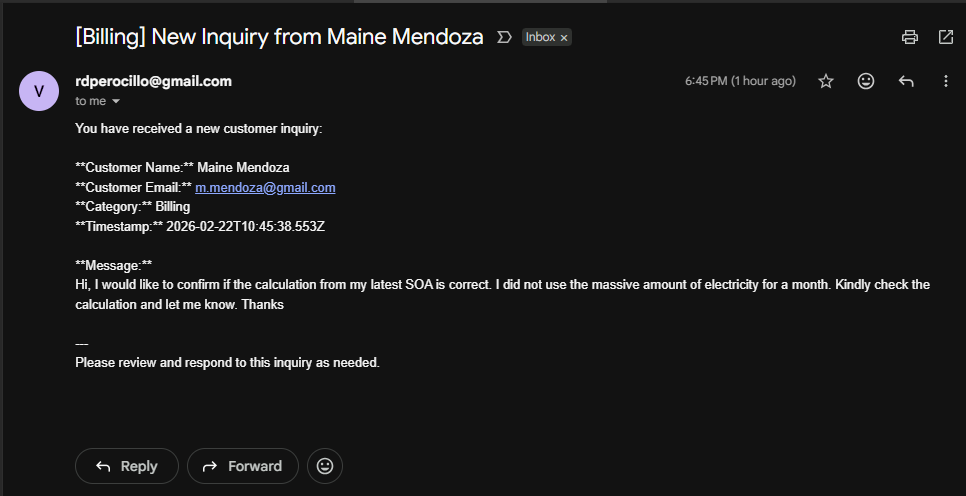

# Smart Inquiry Intake, Auto‑Reply & AI Triage

## Project Overview
This automation provides a complete inquiry‑handling system using Zapier-native tools. It collects customer inquiries through a Zapier form, cleans and structures the data, uses AI to categorize the message, stores everything in a Zapier Table, and sends an instant, professional auto‑reply. It gives small businesses a fast, organized, and intelligent intake workflow.

## Problem It Solves
Small businesses often struggle with slow responses, inconsistent lead tracking, and difficulty identifying the type of inquiry. This automation removes manual work by:
- Capturing inquiries in a structured form  
- Automatically replying to customers  
- Categorizing messages using AI  
- Logging all data in a central table  

It improves response time, organization, and customer experience.

## Apps Used
- **Zapier Interfaces (Form)** – Inquiry intake  
- **Zapier Tables** – Lead database  
- **Formatter by Zapier** – Clean and standardize data  
- **Zapier AI Agent** – Categorize inquiry content  
- **Email by Gmail** – Auto‑reply and Internal notifications

## Step‑by‑Step Workflow
1. **Trigger:** A customer submits an inquiry through a Zapier Interfaces form.  
2. **Formatter:** Clean and format fields (e.g., proper-case name, trim whitespaces).  
3. **AI Agent:** Analyze the message and categorize it (Sales, Support, Billing, General).  
4. **Zapier Tables:** Store the inquiry, category, and timestamp in a structured database.  
5. **Auto‑Reply Email:** Send a personalized confirmation message to the customer.  
6. **Internal Notification:** Alert the business owner via Gmail with inquiry details.  

## 🖼️ Screenshots
AI Workflow

Zapier Form

Zapier Table/Database

Customer Auto-Reply

Internal Alert

## Notes on Customization
- Replace the form fields or add conditional questions as needed.  
- Modify the AI Agent prompt to refine categorization or tone.  
- Customize the auto‑reply email with branding or dynamic content.  
- Add filters or paths for different inquiry types.  
- Integrate with CRMs (HubSpot, Zoho) for advanced lead management.  
- Add SMS or WhatsApp notifications for faster internal alerts. 
